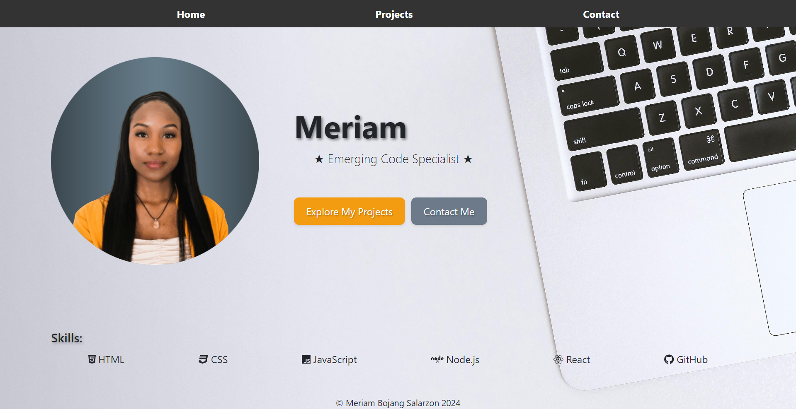

# React Portfolio 📄

Welcome to My React Portfolio! :)



Direct Link to Application: [CLICK HERE](https://65d3a8e9cfee532207a3284d--starlit-monstera-f77478.netlify.app/)

## Description

Hello and thank you for visiting my React portfolio! My name is Meriam, and this platform serves as a comprehensive showcase of my journey in the world of software development. Here, you'll find a curated collection of my projects, an overview of my skills, and insights into my professional experience. I am committed to ongoing learning, consistently taking on new challenges to enhance my skills. This portfolio provides a snapshot of my current abilities, with the understanding that it's a work in progress—evolving as I acquire new skills and experiences.

- [Installation](#installation)
- [Features](#features)
- [Resources](#resources)
- [License](#license)

## Installation

To run this project locally, follow these steps:

1. **Clone the repository to your local machine:**
    ```bash
    git clone https://github.com/Msalarzon/react-portfolio
    ```

2. **Ensure you have Node.js and React installed:**
    - If not installed, download and install them from [Node.js](https://nodejs.org/) and [React](https://reactjs.org/).

3. **Navigate to the project directory:**
    ```bash
    cd your-repository
    ```

4. **Install project dependencies:**
    ```bash
    npm install
    ```

5. **Start the development server:**
    ```bash
    npm start
    ```

## Features

Key Features:

1. **Tech Stack:**
   - Built with React.
   - Utilizes React Router for seamless navigation.

2. **Information:**
   - Includes my name, contact details, projects, and skills.

3. **CV Section:**
   - Provides a link to an up-to-date PDF CV.

4. **Projects Section:**
   - Dynamically showcases six projects.
   - Each project includes title, deployment link, GitHub repository link, and a GIF/screenshot.

5. **Contact Section:**
   - Links to PDF CV, GitHub profile, and LinkedIn page.
   - Features an email contact form.

## Resources

- [MDN Web Docs](https://developer.mozilla.org/): JavaScript documentation and examples.
- [Stack Overflow](https://stackoverflow.com/): Community for problem-solving and debugging.
- [W3Schools](https://www.w3schools.com/): Source for learning and practicing web development concepts.
- [GitHub](https://github.com/): For version control and project hosting.
- [React Documentation](https://reactjs.org/): Official documentation for the React JavaScript library.
- [Node.js Documentation](https://nodejs.org/en/docs/): Official documentation for Node.js, a JavaScript runtime.
- [Netlify](https://www.netlify.com/): Platform for continuous deployment and hosting.
- [edX](https://www.edx.org/): Online learning platform offering courses, including web development and programming.

## License

This project is licensed under the [MIT License](LICENSE). Feel free to use, modify, and distribute it at your own risk.
